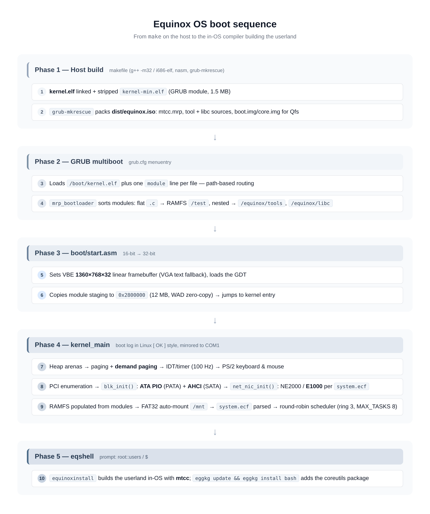
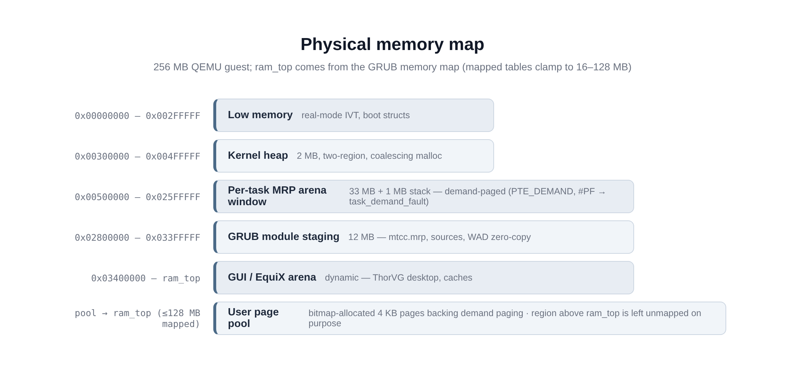

# Architecture — technical overview (0.4 Beta)

This document maps how Equinox OS is put together and how it works,
from power-on to the OS compiling its own tools. Every concrete number
(addresses, sizes, limits) is taken from the current source tree.

## 1. Boot flow



```
GRUB (ISO, multiboot)
  │  loads kernel.elf + one module line per file (path-based routing:
  │  flat .c -> RAMFS /test, nested -> /equinox/tools, /equinox/libc;
  │  .mrp/.wad by dist/ structure; kernel-min.elf module named
  │  /boot/kernel.elf via cmdline trick)
  ▼
boot/start.asm      — VBE 1360x768x32 (VGA text fallback), GDT,
  │                   module staging at 0x2800000 (12 MB), kernel entry
  ▼
kernel.cpp          — heap arenas, paging + demand paging, IDT/timer,
  │                   PS/2, PCI enumeration, blk_init (ATA PIO + AHCI),
  │                   net_nic_init (system.ecf), RAMFS from modules,
  │                   FAT32 auto-mount /mnt, ecf load, scheduler, nettask
  ▼
shell (kernel/shell.cpp) — prompt root::users / $
  │
  ├─ equinoxinstall -> mtcc (in-OS) -> userland .mrp
  └─ eggkg update && eggkg install bash -> /bin (packages)
```

The boot log is Linux-`[ OK ]`-styled and mirrored to serial COM1
(`-serial file:serial.log`).

## 2. Source layout

```
boot/            start.asm (VBE + module staging), grub.cfg template,
                 early.cfg for grub-mkimage (boot.img/core.img)
kernel/
  kernel.cpp     entry + subsystem integration
  shell.cpp      shell, pipes/glob/redirect, eqbash aliases,
                 equinoxinstall wizard, Qfs, set/ecf, es runner
  eggkg.cpp      package manager (update/install/remove/…, SHA-256 verify)
  library/
    drivers/     ata.cpp (PATA PIO), ahci.cpp (SATA), blk.cpp (block
                 layer), ps2_mouse.cpp
    net/…        lwIP glue, ne2000.c, e1000.c, nic.c registry,
                 httpd.c, tls_client.c (BearSSL)
    paging, malloc (2-region), task, syscall, usermode (ring 3),
    fs_ram, fs_fat32(+write, +format), ecf.c, egg_sha256.c,
    elf, mrp_loader, mrp_api, libc, stdio (multi-console + canvas),
    guiarena, UI/ (LVGL apps), equinox_desktop (ThorVG)
mtcc.c           the in-OS C compiler (canonical source)
tools_user/      tool sources shipped on the ISO (text filters;
                 bash-class coreutils intentionally absent)
libc/            libc module sources mirrored for packaging
mrp_user/        Morph.h SDK, mrp_pack.py, elf_link.ld
doomgeneric/     DOOM port -> doom.mrp
third_party/     lwIP 2.1.3 + BearSSL 0.6 (+ root CA anchors)
scripts/         build helpers + QEMU regression harnesses
docs/            this documentation
```

## 3. Memory map



| Area | Address / size | Contents |
| --- | --- | --- |
| Kernel heap | 0x300000–0x500000 (2 MB) + gap ≈1 MB | two-region coalescing malloc; realloc merges only physically adjacent blocks |
| Per-task MRP arena | 0x500000–0x2600000 (33 MB) + 1 MB stack | window reserved via `PTE_DEMAND`; #PF (`isr_14 → task_demand_fault`) allocates + zero-fills on first touch; reset per task exit |
| Module staging | 0x2800000 (12 MB) | GRUB modules (mtcc.mrp, sources, WAD — zero-copy) |
| GUI / EquiX arena | 0x3400000 … ram_top | dynamic (follows `paging_set_ram_top()`); ThorVG desktop, caches |
| User page pool | bitmap-allocated 4 KB pages | backs demand paging |
| RAM top | from the GRUB memory map | page tables = ceil(ram_top/4 MB) clamped 16–32; **region above ram_top is left unmapped on purpose** |

256 MB guest RAM (`-m 256`) is the recommended configuration; 64 MB
boots but is tight. Per-task arena layout is guarded by
`static_assert` against the heap arena structure.

## 4. Multitasking

- **Scheduler**: preemptive round-robin at 100 Hz (quantum 1 tick),
  FPU state `fxsave/fxrstor` per task, ring-3 trampoline entry
  (TSS; user CS 0x1B / DS 0x23). `MAX_TASKS` = 8.
- **Virtual consoles**: each task mirrors its own cell buffer + cursor;
  F1/F2 selects the active console; a background task's printf never
  overwrites another console.
- **Lifecycle**: `spawn/spawn2` → exit → child becomes **zombie**
  (slot + status held for the parent) → `wait` reaps; orphans reaped
  when the parent dies; a full table steals the oldest zombie.
- **Pipes**: `SYS_PIPE` 4 KB kernel rings, ref-counted ends, inherited
  across spawn; blocking read/write with EOF and broken-pipe
  detection. The shell composes `grep … | tr … > file` from these.
- **Idle discipline**: when everything blocks, the scheduler `hlt`s
  with interrupts on — no busy spinning, tick-precise sleeps.

## 5. System calls

`int 0x80`, ring 3, append-only table `#1–#54` — full reference in
[SYSCALLS.md](SYSCALLS.md). Groups: console/input, text output, legacy
whole-file I/O, positional fd I/O (`open2` with O_CREAT/TRUNC/APPEND/
EXCL/DIR, unlink/mkdir/rmdir/rename/stat/readdir/fstat), memory
(per-task arena malloc/free + meminfo), processes (spawn/spawn2/wait/
kill/taskinfo), pipes, framebuffer + per-task clip/line drawing,
network info/ping, mouse/keyboard events, audio.

Ring-3 pointer arguments are validated by the uaccess check
(`SYS_EFAULT`). Per-task fd table + cwd + args live in `struct Task`.

## 6. Storage & filesystems

- **Block layer** (`blk.cpp`): 8 fixed slots — PATA on 0–3, AHCI on
  4+; drivers fill a `blk_desc` with read/write function pointers.
  Details in [DRIVERS.md](DRIVERS.md).
- **ATA PIO** (`ata.cpp`): polling task-file I/O, LBA28/LBA48,
  IDENTIFY, FLUSH CACHE after writes, sched-locked transfers.
- **AHCI SATA** (`ahci.cpp`): ABAR (BAR5), GHC.AE, per-port engine
  stop/start, DET/ATAPI checks, command list + FIS receive + PRDT DMA,
  READ/WRITE DMA (EXT), port restart on any failure.
- **RAMFS** (`fs_ram.cpp`): in-memory tree populated from GRUB modules;
  `dist/` on the host mirrors the layout.
- **FAT32** (`fs_fat32*.cpp` + `fs_fat32_format.cpp`): read/write with
  LFN + 8.3 anti-collision mangling, FSInfo, directories grown
  on-demand, rollback on I/O failure, 8 MB disk cache arena outside the
  kernel heap; write-through per close. `fat32_mkfs` formats a whole
  disk (MBR, type 0x0C @ LBA 2048, label EQUINOXBASE).
- **Mounting**: first FAT32 partition of an IDE disk auto-mounts at
  `/mnt` (lazy RAMFS mirror → `ls/cat/edit/mget` transparent); a volume
  labelled **EQUINOXBASE** is promoted to **root** at boot — that is how
  an installed disk becomes `/`.
- Host-side tested against an mtools oracle + mini-fsck up to 100%
  utilization.

## 7. Networking

lwIP 2.1.3 (`NO_SYS`, cooperative polling) driven by the kernel
nettask; NICs behind the `nic.c` registry — **NE2000 ISA** (default)
and **Intel E1000 PCI** (`8086:100E/100F`). Driver selection per
`system.ecf` `[net] driver`. On top: DHCP/DNS/ICMP/TCP, `mget` with
BearSSL TLS 1.2 (9 Mozilla root CAs), `httpd` on :80, `tcpping`.
Details in [NETWORKING.md](NETWORKING.md) / [DRIVERS.md](DRIVERS.md).

## 8. Graphics & desktop

- Linear framebuffer 1360×768×32 (VESA DISPI; VGA text fallback with
  snap-color).
- Multi-console: per-console cell mirror + per-task pixel canvas
  (first draw snapshots the text screen; exit re-renders it).
- Per-task draw windows: `SYS_SETCLIP` clip rectangle (kernel-side
  intersection), `SYS_DRAWLINE` Bresenham focus-gated.
- **LVGL 9** apps (file manager, settings, editor) over framebuffer +
  PS/2 mouse.
- **EquiX desktop**: ThorVG vector renderer, dynamic GUI arena
  (`guiarena.cpp`).

## 9. Executable formats & compiler

- **MRP1**: flat ring-3 binary + 18-byte header @0x500010; loader
  `mrp_loader.cpp`; per-task arena (demand-paged); morph API
  (`mrp_api`, ~20 calls).
- **ELF32**: static `ET_EXEC` mapped into the demand window;
  `elfdemo.elf` built with `gcc -m32 -nostdlib -T mrp_user/elf_link.ld`.
- **mtcc** (`mtcc.c`): lexer → parser → direct x86-32; mini
  preprocessor splicing `<morph.h>` etc.; libc subset (printf ≤5 args,
  sscanf, ctype, qsort, rand); undefined references reported with the
  call-site line. See [SELF_HOSTING.md](SELF_HOSTING.md).
- **ruf v3** recipes drive `mtcc -make` (variables `:=`, jobs,
  `copy/move ? to`) — the eggkg install engine.

## 10. Configuration & packages

- **`.ecf`** INI-lite store parsed by `ecf.c`; `set` builtin
  (get/put/list/-a/-w/-d/-b/-x); `system.ecf` in
  `/equinox/conf/` (legacy `boot/` fallback) with an
  `active.conf` overlay pointer. See [CONFIGURATION.md](CONFIGURATION.md).
- **eggkg** (`eggkg.cpp`): package manager over package.list v0 +
  index.idx v1 (SHA-256 via `egg_sha256.c`), sources → `mtcc -make`
  build → `/bin` install → `installed.db` + boot-time `.local` sync.
  The bash coreutils are a package, not a bundled component. See
  [PACKAGES.md](PACKAGES.md).
- **eqshell scripts** (`.es`): first line `[Eqshell]`, run with
  `set -x`, transcript in `/eqshell.log`.

## 11. Build & test harness

- Makefile host build (`g++ -m32` or i686-elf cross), `-MMD -MP`
  dependency tracking; targets `all/run/run-disk/run-img/run-e1000/
  run-ahci/diskimg/img/bootimg/pack/mtcc/tools/libc/doom/test`.
- QEMU regression suites (`scripts/`):
  `regression_task3.py` (core: boot, tool battery, gfx
  pixel-proof, libc, soak), `regression_task2.py` (fstest demand
  paging, ELF, wait/pipe/zombie), `regression_v03.py`, 
  `regression_multitask.py` (canvas/games/F1-F2/DOOM) — **101 checks**
  on a release ISO;
  plus 0.4 suites: `installer_wizard_test.py` (blank disk → bootable
  `/`), `ahci_test.py` (17), `e1000_test.py`, `ecf_test.py` (25),
  `install_test.py` (23), `base_img_test.py` (15), `mnt_build_test.py`
  (7), `eggkg_build_test.py` (full bash package build in-OS).

## 12. Design invariants (worth knowing before hacking)

1. Syscalls are append-only; #0 stays unused.
2. No work from IRQ context beyond ACK + ring-drain (NIC) — the stack
   and storage both run in task context under sched locks.
3. Fixed block slots: PATA keeps 0–3 even if absent; SATA starts at 4.
4. The ISO carries sources; the OS builds them. Fresh boot = sources
   again = `equinoxinstall` is idempotent per session.
5. The region above `ram_top` is deliberately unmapped — wild access
   faults loudly instead of corrupting silently.
6. DMA memory is identity-mapped BSS (AHCI/E1000) — keep it that way
   or add bounce buffers consciously.
