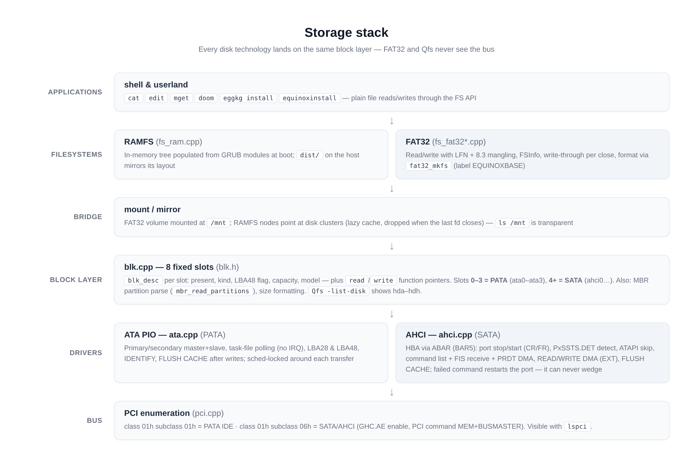
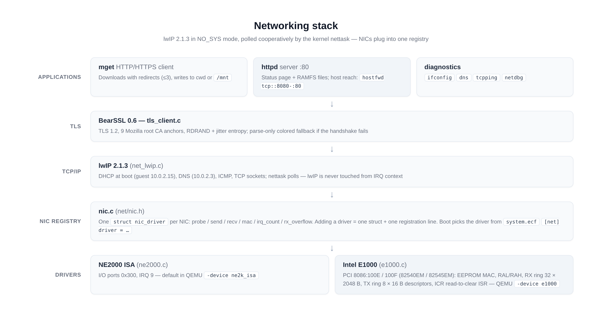

# Drivers — storage (ATA PIO / AHCI SATA) and network (NE2000 / E1000)

Equinox 0.4 ships four hardware drivers organized in two layers: a
**block layer** (`blk.cpp`) that every disk driver plugs into, and a
**NIC registry** (`nic.c`) that every network card plugs into. Higher
subsystems (FAT32, Qfs, eggkg / lwIP) never talk to hardware directly.

## Storage stack



### Block layer — `kernel/library/drivers/blk.cpp`

Eight **fixed-index slots** (holes keep their index, so a PATA disk is
always `ata0..ata3` and a SATA disk always lands on slot 4 or higher):

```c
#define BLK_MAX_DRIVES  8     // 0..3 legacy PATA, 4..7 AHCI
#define BLK_PATA_SLOTS  4     // first AHCI slot
#define BLK_SECTOR_SIZE 512

struct blk_desc {
    int present, kind;        // BLK_PATA / BLK_ATAPI / BLK_AHCI
    int lba48;                // drive supports 48-bit LBA
    uint64_t total_sectors;
    char name[16];  char bus[24];  char model[41];
    void* ctx;                // driver context, handed back on I/O
    int (*read)(void* ctx, uint64_t lba, uint32_t n, void* buf);
    int (*write)(void* ctx, uint64_t lba, uint32_t n, const void* buf);
};
```

`blk_init()` brings the drivers up **in order** (`ata_init()` first, so
legacy disks keep slots 0–3; then `ahci_init()` claims 4+). On a
machine without AHCI, `ahci_init()` returns immediately and the boot is
identical to a PATA-only one. Consumers: `blk_read` / `blk_write`
(bounds-checked, ≤128 sectors per call), `mbr_read_partitions` (bus
neutral MBR parse), `blk_format_size`. `Qfs -list-disk` and
`fat32_slot_scan` are built on top.

### ATA PIO — `ata.cpp` (PATA, `hda`–`hdd`)

- Four drives: primary/secondary × master/slave, task-file programmed
  I/O, **polling, no IRQ** — deliberately simple and interrupt-safe.
- **IDENTIFY DEVICE** on init (model string, LBA support, capacity,
  LBA48 capability from word 83); ATAPI devices are listed as
  `BLK_ATAPI` but not mountable.
- Reads/writes use LBA28, transparently upgrading to **LBA48** when the
  drive supports it and the LBA exceeds 28 bits.
- **FLUSH CACHE** after every write so data is durable in the backing
  file even if QEMU is killed.
- Every transfer runs under `task_sched_lock()` — no preemption can
  split a multi-sector operation, so no other locking is needed.

### AHCI SATA — `ahci.cpp` (`hde`+)

Full AHCI 1.x host controller driver (PCI class `01h/06h`):

1. **Controller**: claim BAR5 as the ABAR, set PCI command
   `MEM | BUSMASTER | IO`, set `GHC.AE` (without it ports sit in legacy
   IDE mode).
2. **Per port** (`CAP.PI` mask, up to 8 tracked): stop both DMA engines
   and wait for CR/FR to drop (SeaBIOS may have left the port running
   against reclaimed buffers), require `PxSSTS.DET == 3`, skip ATAPI
   (`PxSIG == 0xEB140101` — CD over AHCI is deferred), program
   PxCLB/PxFB, clear PxIS/PxSERR, start with `ST|FRE|SPIN_UP|POD`.
3. **Command model**: one slot (slot 0) — command header + command
   table with a PRDT split on 4 KB boundaries (24 entries ≈ 64 KB per
   command, 128-sector chunks at most through the block layer), poll
   `PxCI` clearing with `PxIS.TFES` as an early bail-out, then check
   PxTFD for ERR/DF. On any failure the port is **restarted** (dropping
   ST resets PxCI in hardware) — a failed command can never wedge the
   controller.
4. **Commands**: `IDENTIFY`, `READ/WRITE DMA` + `_EXT` (LBA48 when the
   drive reports it), `FLUSH CACHE(_EXT)` after writes.
5. Discovered disks are handed to the block layer as `BLK_AHCI`
   (`ahci0`, …) on slots `BLK_PATA_SLOTS + n`.

DMA buffers are static, identity-mapped BSS allocations (command list
1024-byte, FIS receive 256-byte, command table 128-byte aligned), the
same assumption the E1000 rings make — no bounce buffers needed at
these RAM sizes.

### PCI matching — `pci.cpp`

Boot-time enumeration records vendor/device, class/subclass, IRQ line
and BARs per function (`lspci` prints the table). Drivers match on
class, not on model lists:

| Device | Match | Notes |
| --- | --- | --- |
| PATA IDE | class `01h`, subclass `01h` | legacy PIIX in QEMU |
| SATA/AHCI | class `01h`, subclass `06h` | QEMU ich9-ahci `8086:2922`; BAR5 = ABAR |

## Network drivers



### NIC registry — `kernel/net/nic.{c,h}`

One struct per driver; the stack talks to "the active NIC" through thin
wrappers and never names a driver:

```c
struct nic_driver {
    const char*   name;            /* "ne2000-isa", "e1000-pci"          */
    int  (*probe)(void);           /* detect + init; 1 = present         */
    int  (*send)(const uint8_t* frame, int len);
    int  (*recv)(uint8_t* frame, int maxlen);
    const uint8_t* (*mac)(void);
    uint32_t (*irq_count)(void);       /* optional stats                 */
    uint32_t (*rx_overflow)(void);     /* optional stats                 */
};
```

`net_nic_init()` probes in registration order; the first driver that
reports present wins — unless `system.ecf` pins one (`[net] driver =
e1000`, see [CONFIGURATION.md](CONFIGURATION.md)). With no config the
fallback order is `ne2000`, then `e1000`. PCI NICs that are recognized
but have no driver are reported honestly at boot instead of being
silently ignored.

Driver model (both drivers share it): `probe()` maps the device,
enables PCI command bits and brings the rings up; the ISR only ACKs and
drains into a ring — **lwIP is never touched from IRQ context**;
`recv()` hands one completed RX descriptor to the stack and returns the
buffer to the NIC; `send()` waits for the descriptor-done flag before
returning so the stack can release the frame buffer.

### NE2000 ISA — `ne2000.c`

- I/O ports `0x300`, IRQ 9 — QEMU's default `-device ne2k_isa`.
- 16-bit programmed I/O ring, the classic DP8390 register model.

### Intel E1000 — `e1000.c` / `e1000.h`

- PCI `8086:100E` (82540EM) / `8086:100F` (82545EM) — QEMU
  `-device e1000`, MMIO BAR0, INTx on the PCI IRQ line.
- MAC from the **EEPROM** (`EERD`) with RAL/RAH fallback.
- RX ring: 32 × 2048-byte descriptors (`RCTL.BSIZE=00`), replenished
  Linux-style (`RDT` = index just consumed).
- TX ring: 8 × **16-byte** descriptors (EOP|IFCS|RS), DD-flag polled
  send.
- ICR is read-to-clear; IMS masks only TXDW/RXT0/RXDMT0/LSC.
- Link up via `CTRL.SLU|ASDE`; `STATUS.LINK` reported to `ifconfig`.

### QEMU device cheat-sheet

| Driver | make target | Manual device flag |
| --- | --- | --- |
| ATA PIO (PATA) | `run-disk` | `-drive file=…,if=ide,index=0` |
| AHCI (SATA) | `run-ahci` | `-device ahci,id=ahci -drive …,if=none,id=hd0 -device ide-hd,drive=hd0,bus=ahci.0` |
| NE2000 | `run` | `-device ne2k_isa,netdev=net0,iobase=0x300,irq=9` |
| E1000 | `run-e1000` | `-device e1000,netdev=net0` |

## Adding a driver

**A block device** — implement two functions, fill one struct:

```c
#include "header/blk.h"

static int myblk_read(void* ctx, uint64_t lba, uint32_t n, void* buf) { /* ... */ }
static int myblk_write(void* ctx, uint64_t lba, uint32_t n, const void* b) { /* ... */ }

/* during init: */
struct blk_desc* b = blk_at(FREE_SLOT);
b->present = 1;  b->kind = BLK_PATA /* or BLK_AHCI-like kind */;
b->total_sectors = my_capacity();
snprintf(b->name, sizeof(b->name), "myblk0");
b->ctx = my_ctx;  b->read = myblk_read;  b->write = myblk_write;
```

FAT32, Qfs and the installer pick it up automatically.

**A NIC** — implement `struct nic_driver` (see above), register it in
`nic.c`'s table, done: probe, send, recv, mac; lwIP, DHCP, `mget`,
`httpd` all work over it without further changes. (E1000 was added
exactly this way.)
