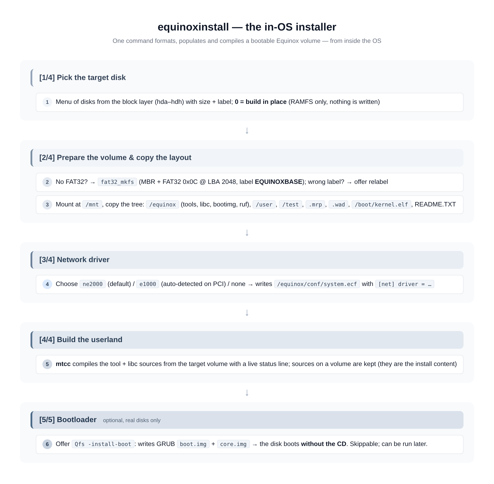

# Installing Equinox OS

Equinox installs **from inside itself**: you boot the ISO, run the
installer, and the OS formats a disk, copies its own layout onto it and
compiles the userland there with the in-OS compiler. Two paths:

- **Path A — `equinoxinstall`** (recommended): a 4-phase interactive
  wizard. One command, few prompts, bootable result.
- **Path B — manual**: individual commands (`Qfs`, `mount`, `copy`,
  `set`, `Qfs -install-boot`) for scripted or surgical installs.

Either way, afterwards the target disk boots **without the CD**.

> **What ships and what does not:** the base system carries the kernel,
> shell, mtcc + tool/libc **sources**, the EquiX desktop and the Qfs /
> eggkg machinery. The classic coreutils (`ls cat cp mv rm mkdir rmdir
> rm touch stat` and friends) are **not bundled** — they are installed
> as the `bash` package via `eggkg` right after the first boot (see
> [PACKAGES.md](PACKAGES.md)). Until then the shell's builtins and
> aliases cover basic navigation.

---

## Path A — the `equinoxinstall` wizard

Run it from the shell:

```
root::users / $ equinoxinstall
```



### [1/4] Pick the target disk

The wizard lists every disk the block layer knows (hda–hdh, with size
and label — this spans both PATA and SATA/AHCI disks, see
[DRIVERS.md](DRIVERS.md)):

```
[1/4] pilih disk target
   0)  build in place (tanpa install ke disk)
   1)  hda  64.0 MB  ...
  target [0]:
```

- `0` or plain **Enter** → *build in place*: compile into RAMFS, skip
  all disk work. Perfect for a quick first try (`make run`).
- A disk number → continue to phase 2.

### [2/4] Prepare the volume + copy the layout

- No FAT32 partition on the disk → the wizard offers to format:
  `fat32_mkfs` writes a fresh MBR with a whole-disk FAT32 partition
  (type `0x0C` at LBA 2048) labelled **EQUINOXBASE**.
  ⚠️ **Formatting destroys everything on the disk.**
- A FAT32 partition with a different label → offer to relabel it to
  `EQUINOXBASE` (required for the volume to be promoted to `/` on boot).
- The volume is mounted at `/mnt`, then the layout is copied onto it:
  `/equinox` (tools, libc, bootimg, ruf recipes), `/user`, `/test`,
  `.mrp` programs, `.wad` files, `/boot/kernel.elf`, `README.TXT`.

### [3/4] Network driver

Pick the NIC the installed system should use at boot:

```
   1) ne2000   NE2000 ISA 0x300 IRQ9 — default
   2) e1000    Intel PRO/1000 PCI — DETECTED on the PCI bus
   3) no networking
```

The choice is written to `/equinox/conf/system.ecf` on the target:

```ini
# konfigurasi sistem — ditulis oleh equinoxinstall
[net]
driver = e1000
```

At the next boot `net_nic_init()` reads it (see
[CONFIGURATION.md](CONFIGURATION.md)). If you pick `e1000` without the
card being present the boot falls back to the NE2000.

### [4/4] Build the userland

`mtcc` compiles the tool + libc sources **from the target volume** with
a live status line. On a volume the sources are *kept* — they are the
install content and allow later rebuilds with `equinoxinstall -compile`.
RAMFS-only builds remove the sources after a successful compile (that
content comes back with the next ISO boot anyway).

### [5/5] Bootloader (optional)

For a real disk target the wizard offers:

```
[5/5] pasang bootloader GRUB ke hda (boot tanpa CD)? [y/N]
```

Answering `y` runs `Qfs -install-boot`, which writes GRUB `boot.img` +
`core.img` (staged in RAMFS at `/equinox/bootimg/`) onto the disk. Skip
it now if you like — it can be run at any time later.

### Reboot into the install

```
root::users / $ reboot
```

Remove the ISO (or let `-boot order=d` still prefer the CD); the disk
now boots GRUB → Equinox with its userland already compiled and
persistent.

### Wizard shortcuts (no disk work)

| Command | What it does |
| --- | --- |
| `equinoxinstall` | Full wizard (phases 1–4 + optional 5) |
| `equinoxinstall -compile <dir>` | Only phase [4/4]: compile userland from `<dir>` (expects `<dir>/libc` + `<dir>/tools`) |
| `equinoxinstall -build <file.ruf>` | Build one ruf v3 recipe via `mtcc -make` |
| `equinoxinstall -build <name>` | Build a single tool from `/equinox/tools` (`mtcc -c`) |
| `equinoxinstall -build *.ruf` | Build every matching recipe (single-star glob) |

## Path B — manual install

Every wizard step is also a standalone command; this is the route for
scripts and for people who want control.

```sh
# 1. See what is attached (PATA slots 0-3 -> hda..hdd, SATA/AHCI -> hde..)
Qfs -list-disk

# 2. Format the target (DESTROYS its contents) as FAT32 label EQUINOXBASE
Qfs -t hde -format fat32

# 3. Mount it and copy the layout with the copy builtin
#    (glob, directories auto-created, recursive-copy guard)
mount hde
copy /equinox        -> /mnt/equinox
copy /user           -> /mnt/user
copy /test           -> /mnt/test
copy /boot/kernel.elf -> /mnt/boot/kernel.elf

# 4. Write the boot configuration (INI-lite .ecf, see CONFIGURATION.md)
save /mnt/equinox/conf/system.ecf << "# config"
[net]
driver = ne2000

# 5. Install the GRUB bootloader so the disk boots without the CD
Qfs -install-boot hde

# 6. Build the userland in place (sources were copied with the layout)
equinoxinstall -compile /mnt/equinox

# 7. Optional: pivot the base directory, applied at next boot
set -b /mnt/equinox

umount hde
reboot
```

Notes:

- `copy SRC -> DST` (the `->` is optional) copies files *and* trees;
  the destination directory is created automatically.
- `set -d FILE [-path DIR] [-base SRC]` registers an `.ecf` as the
  system config; `set -b PATH` records the base pivot; both are
  persisted through `system.ecf` (see
  [CONFIGURATION.md](CONFIGURATION.md)).
- `Qfs -install-boot hdX` needs `/equinox/bootimg/{boot.img,core.img}`
  in RAMFS — the ISO ships them (`make bootimg`).

## After the first boot of an install

```sh
# the coreutils are still not bundled — fetch them:
eggkg update && eggkg install bash -y

# and verify the system picked up its config:
set list            # active .ecf contents
ifconfig            # driver per system.ecf + DHCP lease
info                # version, RAM, uptime
```

## Sizing the install

| Media | Minimum | Comfortable |
| --- | --- | --- |
| Guest RAM (QEMU `-m`) | 64 MB | **256 MB** |
| Target volume | ~32 MB | 64 MB+ (room for packages, DOOM WAD, downloads) |

The FAT32 write path is write-through per `close`, so there is no
"eject" semantics beyond `umount` — but prefer a clean `umount` before
killing QEMU after writes.
