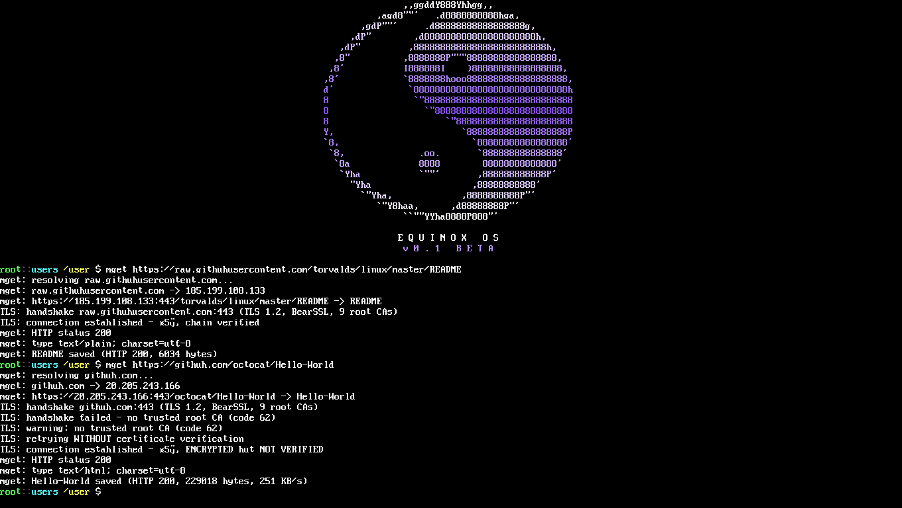

# Networking

Equinox ships a real TCP/IP stack: DHCP and DNS at boot, TCP sockets,
an HTTP(S) client (`mget`) with TLS 1.2, and a small web server
(`httpd`). Two NIC drivers are supported: the classic **NE2000 ISA**
and the **Intel E1000 PCI** — see [DRIVERS.md](DRIVERS.md) for the
hardware layer.


## Stack layout

```
mget (client)   httpd (server :80)   tcpping / dns / ifconfig
        │               │                      │
        └──── BearSSL TLS 1.2 (https)          │
                      │                        │
              lwIP 2.1.3  (NO_SYS, cooperative polling from nettask)
              DHCP · DNS · ICMP · TCP
                      │
              nic.c registry  (probe / send / recv / mac)
              ├─ ne2000.c   NE2000 ISA  0x300, IRQ 9
              └─ e1000.c    Intel PRO/1000 PCI 8086:100E/100F
```

- **lwIP 2.1.3 in `NO_SYS` mode**: no OS locking; the kernel `nettask`
  polls the stack cooperatively, and the NIC ISR only ACKs + drains a
  ring — lwIP is never touched from interrupt context.
- **BearSSL 0.6** provides TLS 1.2 with 9 Mozilla root-CA anchors and
  RDRAND+jitter entropy. If a handshake fails, `mget` falls back to a
  parse-only (colored) render rather than crashing.
- The **NIC registry** (`nic.c`) is one struct per driver (see
  [DRIVERS.md](DRIVERS.md)); the boot driver choice comes from
  `system.ecf` (`[net] driver = …`) or registration order.

## QEMU user-mode networking

| Fact | Value |
| --- | --- |
| Guest address | `10.0.2.15/24` (via DHCP at boot) |
| Gateway / host | `10.0.2.2` |
| DNS | `10.0.2.3` |
| ICMP | **not forwarded** by slirp — use `tcpping <host> [port]` |
| Host → guest :80 | add `hostfwd=tcp::8080-:80` to `-netdev`, then browse `http://localhost:8080/` |

Run variants: `make run` (NE2000), `make run-e1000` (E1000 + install
image). Manual flags are listed in
[GETTING_STARTED.md](GETTING_STARTED.md) and [DRIVERS.md](DRIVERS.md).

## The driver choice at boot

`net_nic_init()` resolves in this order:

1. `system.ecf` `[net] driver = ne2000 | e1000 | none` —
   written by `equinoxinstall` phase [3/4] or edited with `set`;
2. registration order fallback: `ne2000`, then `e1000`.

Verify with `ifconfig` (driver name, MAC, DHCP lease, TX/RX counters)
or `nettask` / `netdbg` for stack statistics.

## Command reference

| Command | Function |
| --- | --- |
| `ifconfig` | Interface status: driver, MAC, IP (DHCP), packet counters |
| `dns <hostname>` | Resolve a name via DNS |
| `tcpping <host> [port]` | TCP connect probe + RTT (ICMP `ping` works on real NICs/hardware, not through slirp) |
| `mget <url> [-port n]` | Download HTTP/**HTTPS** to the current directory; follows up to 3 redirects — `mget https://github.com/octocat/Hello-World` |
| `httpd` | Web server on :80 — status page + RAMFS files |
| `nettask` | Kernel network task status |
| `netdbg` | Stack/driver statistics and diagnostics |

## Examples

```sh
# fetch over TLS (BearSSL) — note https:
mget https://raw.githubusercontent.com/torvalds/linux/master/README

# download straight onto the persistent FAT32 disk
cd /mnt
mget http://10.0.2.2:8022/doom1.wad

# serve the RAMFS to your host browser (make run forwards :8080)
httpd
# host: xdg-open http://localhost:8080/
```

The TLS demo screenshot from the regression suite:


## Design notes

- **No IRQ-context stack work**: the e1000/ne2000 ISR ACKs the
  controller and moves descriptors into a kernel ring; `nettask` does
  all lwIP work. This keeps the driver contract trivial and the stack
  single-threaded by construction.
- **Zero-copy-ish RX**: buffers are pre-allocated 2048-byte descriptor
  buffers (identity-mapped), handed to lwIP, then returned to the NIC —
  no bounce copy on the RX path.
- **Honest degradation**: unrecognized PCI NICs are printed at boot;
  TLS failures fall back to parse-only; a missing NIC leaves the system
  fully usable offline (`driver = none` is a valid config).
