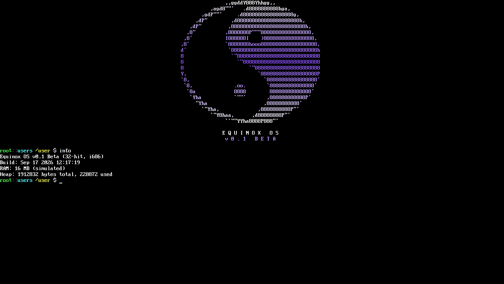

# Equinox OS Documentation — 0.4 Beta

Equinox OS is a 32-bit x86 hobby operating system: a monolithic C++17/C
kernel booted by GRUB into a VESA 1360×768 framebuffer, real ring-3
processes with demand paging, a TCP/IP stack that can fetch files over
HTTPS, persistent FAT32 storage on both PATA (ATA PIO) and SATA (AHCI)
disks — and, the part that defines the project, **the OS compiles its own
userland from C source inside the OS** with its built-in compiler
(`mtcc`), driven either by the `equinoxinstall` wizard or by `eggkg`, the
package manager.

Status: **0.4 Beta** — regression-tested in QEMU (101 core checks plus
dedicated suites for the installer, AHCI, E1000 and `.ecf`).

---

## Documentation map

| Document | Contents |
| --- | --- |
| [GETTING_STARTED.md](GETTING_STARTED.md) | Prerequisites, building the ISO, **every QEMU run variant** (plain, disk, install image, E1000, AHCI/SATA), first boot, troubleshooting |
| [INSTALL.md](INSTALL.md) | Installing Equinox onto a disk — **path A: the `equinoxinstall` wizard**, **path B: fully manual** (`Qfs`, `mount`, `copy`), installing the GRUB bootloader, what ships and what does not |
| [PACKAGES.md](PACKAGES.md) | `eggkg` reference: `update / install / remove / list / search / info / sync`, the package repository format (package.list v0 + index.idx v1), the **bash package** (not bundled — installed via eggkg), writing your own package |
| [QFS.md](QFS.md) | `Qfs` disk tool: `-list-disk`, `-format fat32`, `-install-boot`; disk naming (hda–hdh) and slot mapping |
| [CONFIGURATION.md](CONFIGURATION.md) | The `.ecf` configuration system, the `set` builtin (all flags), `system.ecf` schema, eqshell scripts (`.es`) and `/eqshell.log` |
| [SET.md](SET.md) | Full reference for the `set` builtin — flags, persistence flow, the C API behind it |
| [SYSTEM_ECF.md](SYSTEM_ECF.md) | `system.ecf` schema: every known key, boot-time resolution order, failure modes |
| [ECF.md](ECF.md) | The `.ecf` format and store model: grammar, parse/merge rules, API, validation, limits |
| [EQSHELL.md](EQSHELL.md) | eqshell scripts (`.es`): the `[Eqshell]` contract, transcripts (`/eqshell.log`), provisioning workflows |
| [BOOTING.md](BOOTING.md) | Boot flow — GRUB images, module staging, `kernel_main` order, installed-disk boot |
| [FAT32.md](FAT32.md) | The FAT32 implementation: geometry Equinox writes, LFN/FSInfo/rollback, mount model |
| [MEMORY.md](MEMORY.md) | Memory map, demand paging, kernel heap, DMA buffers, sizing guidance |
| [MULTITASKING.md](MULTITASKING.md) | Tasks, the 100 Hz round-robin scheduler, virtual consoles, pipes, lifecycle |
| [GUI.md](GUI.md) | Framebuffer model, per-task draw windows, LVGL apps, the EquiX/ThorVG desktop |
| [MRP.md](MRP.md) | The MRP1 executable format: header layout, checksum, loader, validation |
| [DRIVERS.md](DRIVERS.md) | Storage stack (block layer, **ATA PIO**, **AHCI SATA**) and network drivers (**NE2000**, **E1000**); PCI matching; how to add a new driver |
| [NETWORKING.md](NETWORKING.md) | lwIP 2.1.3 stack, DHCP/DNS, `mget` (HTTP/HTTPS + TLS), `httpd`, QEMU user-mode networking, NE2000 vs E1000 |
| [SELF_HOSTING.md](SELF_HOSTING.md) | `mtcc` (the in-OS C compiler), MRP1 executables, ruf v3 build recipes, `equinoxinstall -compile/-build`, the build pipeline |
| [MTCC_API.md](MTCC_API.md) | The mtcc prelude headers: `morph.h`, `fileio.h`, `multitasking.h` (+ the hosted `Morph.h` SDK) |
| [SYSCALLS.md](SYSCALLS.md) | The full `int 0x80` interface: syscalls #1–#54, calling convention, errno values |
| [ARCHITECTURE.md](ARCHITECTURE.md) | Technical overview: boot flow, memory map, multitasking, filesystems, networking, graphics, executable formats, build & test harnesses |
| [COMMANDS.md](COMMANDS.md) | Complete shell reference: builtins (incl. `eggkg`, `Qfs`, `set`, `equinoxinstall`), userland tools, pipes/glob/redirect, example session |
| [RELEASE_NOTES.md](RELEASE_NOTES.md) | What is new in 0.4 Beta, known limitations, roadmap |

Historical: [Release/0.1_beta.md](Release/0.1_beta.md).

---

## Quick start (3 steps)

```sh
# 1. Build the kernel + ISO (host Linux)
make

# 2. Boot it in QEMU (256 MB guest RAM, NE2000 NIC, httpd forwarded to :8080)
make run

# 3. Inside the OS: install the userland, then add the coreutils package
equinoxinstall
eggkg update && eggkg install bash -y
```

After `equinoxinstall` the shell has the text toolset (`grep`, `wc`,
`sort`, …). The classic coreutils (`ls`, `cat`, `cp`, `mv`, `rm`,
`mkdir`, …) arrive with the **bash** package via `eggkg` — the base ISO
deliberately ships without them to stay slim; the shell provides
builtins and aliases meanwhile, so basic navigation works out of the box.

## System snapshot

| | |
| --- | --- |
| Architecture | 32-bit x86 (i686), monolithic kernel, C++17 / C / NASM |
| Boot | GRUB Multiboot (`kernel.elf` + boot modules), ISO hybrid |
| Memory | **256 MB recommended** (`-m 256`); 64 MB minimum |
| Display | VESA 1360×768×32 linear framebuffer, VGA text fallback |
| Privilege | Real ring 0 / ring 3 (TSS), syscalls via `int 0x80` (#1–#54) |
| Multitasking | Preemptive round-robin @ 100 Hz, up to 8 tasks, 2 virtual consoles (F1/F2), demand paging |
| Storage | **ATA PIO (PATA)** + **AHCI (SATA)** behind a block layer; FAT32 read/write, RAMFS |
| Networking | lwIP 2.1.3, DHCP/DNS/ICMP/TCP, HTTP(S) client + server; **NE2000 ISA** and **Intel E1000 PCI** |
| Packages | `eggkg` → compiles and installs packages from the [Eggkg-l](https://github.com/amnottdevv/Eggkg-l) repository |
| Compiler | `mtcc` — in-OS single-pass C compiler, MRP1 ring-3 executables |
| Desktop | LVGL 9 apps + ThorVG-powered EquiX vector desktop |


