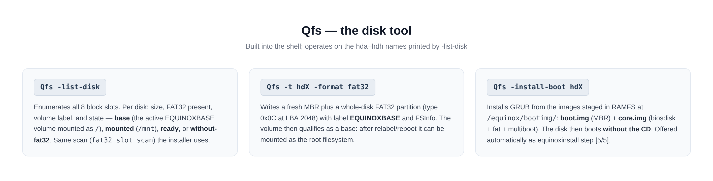

# Qfs — the Equinox disk tool

`Qfs` is the built-in disk management tool of the shell. It works on the
block-layer slot names **hda–hdh** and is the manual counterpart to the
`equinoxinstall` wizard (see [INSTALL.md](INSTALL.md)).



## Disk naming

`Qfs -list-disk` prints the same eight fixed slots the block layer
maintains (see [DRIVERS.md](DRIVERS.md)):

| Qfs name | Block slot | Bus |
| --- | --- | --- |
| `hda` … `hdd` | 0–3 | PATA (ATA PIO driver) |
| `hde` … `hdh` | 4–7 | SATA (AHCI driver) when an AHCI controller is present |

A slot that has no drive prints as empty. With QEMU's `run-ahci` the
SATA disk lands on `ahci.0` port 0 → slot 4 → **`hde`**.

## Commands

### `Qfs -list-disk`

Enumerate all eight slots. Per disk: size, FAT32 present, volume label
and state:

```
root::users / $ Qfs -list-disk
Qfs -list-disk
hda  64.0 MB  FAT32=1 label=EQUINOXBASE base
hdb  (kosong)
...
hde  64.0 MB  FAT32=1 label=-        siap
```

States: **base** (the active EQUINOXBASE volume mounted as `/`),
**mounted** (currently attached at `/mnt`), **ready** (FAT32 present,
not mounted), **without-fat32** (raw). The scan used is
`fat32_slot_scan` — the exact same query the installer and `mount`
rely on.

### `Qfs -t hdX -format fat32`

Format a disk as a fresh Equinox base volume:

- writes a new **MBR**;
- creates one whole-disk **FAT32** partition, type `0x0C` (LBA),
  starting at **LBA 2048** (leaves room for the GRUB bootloader);
- writes the FSInfo sector and the label **EQUINOXBASE**.

⚠️ **Destructive** — everything on the disk is gone. After formatting,
the volume can be mounted (`mount hdX`), populated by hand or by
`equinoxinstall`, and — once labelled `EQUINOXBASE` — promoted to the
root filesystem at boot.

### `Qfs -install-boot hdX`

Make the disk boot **without the CD**:

1. reads `boot.img` + `core.img` from RAMFS `/equinox/bootimg/`
   (staged by the ISO; built on the host with `make bootimg` via
   `grub-mkimage`: biosdisk + fat + multiboot + normal);
2. writes `boot.img` into the MBR (first 446 bytes + signature);
3. writes `core.img` and patches the boot path.

`core.img` is built with `(hd0)/boot/grub` as the prefix and an `early.cfg`
that loads `normal` from the FAT volume — so the GRUB menu then comes
from the disk itself and boots `/boot/kernel.elf` off it.

This is the same routine offered automatically as `equinoxinstall`
phase [5/5].

## Related commands (shell builtins)

| Command | Function |
| --- | --- |
| `mount hdX` / `umount hdX` | Attach / detach the volume at `/mnt` (write-through) |
| `copy SRC [->] DST` | Copy files **and trees**; glob supported; destination dirs auto-created; recursive-copy guard |
| `del PATH` | Delete a file or a tree recursively |
| `diskinfo` | Drive + volume details (layout, free clusters, cache arena) |
| `xxd <file> [n]` | Hex dump — byte-exact proof of disk-backed reads |

## Example — a minimal manual install

```sh
Qfs -list-disk
Qfs -t hde -format fat32
mount hde
copy /equinox         -> /mnt/equinox
copy /boot/kernel.elf -> /mnt/boot/kernel.elf
Qfs -install-boot hde
umount hde
reboot                     # boot the disk without the CD
```

(The wizard does the same plus userland compile + network config in one
command — see [INSTALL.md](INSTALL.md).)
