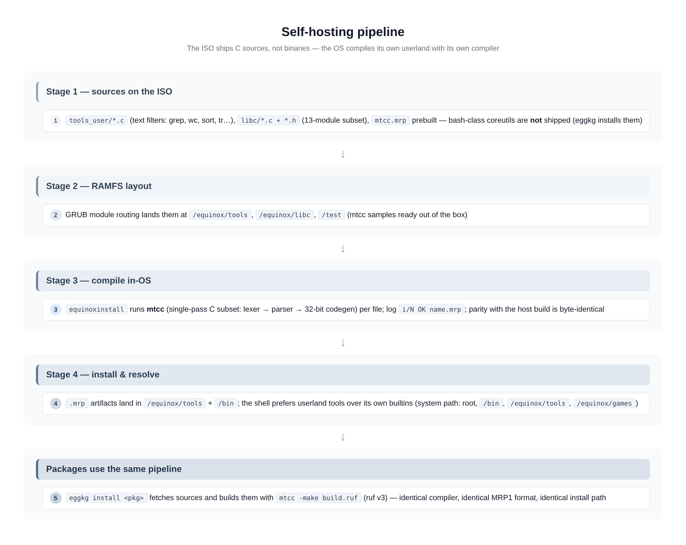

# Self-hosting — mtcc, MRP1, ruf recipes and the build pipeline

The defining feature of Equinox: **the OS compiles its own userland
from C sources, inside the OS, with its own compiler.** The ISO ships
sources, not binaries; on first boot `equinoxinstall` (or `eggkg`) runs
the in-OS compiler `mtcc` over them.



## The pipeline

1. **Sources on the ISO** — `tools_user/*.c` (text filters), 
   `libc/*.c + *.h` (a 13-module C subset), and `mtcc.mrp` (prebuilt
   compiler). The bash-class coreutils are *not* shipped; they arrive
   as a package (see [PACKAGES.md](PACKAGES.md)).
2. **GRUB module routing** — `mrp_bootloader` routes nested `.c`
   modules into RAMFS `/equinox/tools` and `/equinox/libc`; flat `.c`
   files land in `/test` as ready-made mtcc samples.
3. **Compile in-OS** — `equinoxinstall` spawns `mtcc.mrp` per file
   (or `mtcc -make` over a recipe); each successful compile logs
   `i/N OK name.mrp` and the artifact is a **MRP1** ring-3 executable.
   Host vs in-OS output is verified **byte-identical** by the
   regression harness.
4. **Install & resolve** — artifacts live in `/equinox/tools` (+ `/bin`
   for packages); the shell prefers userland tools over its own
   builtins via the system path: root, `/bin`, `/equinox/tools`,
   `/equinox/games`.

## mtcc — the in-OS C compiler (`mtcc.c`)

A single-pass compiler: **lexer → parser → direct x86-32 codegen**, plus
a small preprocessor that splices `<morph.h>` / `<multitasking.h>` /
`<fileio.h>`. Deliberately a C *subset* — the normative specification
is the [mtcc language reference](MTCC_LANGUAGE.md):

- **supported:** `int`/`char`/`void`, pointers and pointer arithmetic
  (scaled by the element size), arrays, `struct`/`union`/`enum`,
  `typedef`, `switch`/`case`/`default`, `if/else/while/for/do/break/
  continue/return`, `sizeof` (a constant — type name or variable),
  block-scope `static` locals, `extern` globals, struct/union/enum
  initializers `= {…}` (global **and** local, nested, arrays of struct,
  union takes its first member);
- **not supported:** `struct`/`union` **by value** as a parameter or
  return value (pass a pointer instead), no `float`, no `unsigned`
  keyword, no cast `(int)x`, no `case` after `default`
  (`default` must be **last**), `continue` inside a `switch` is rejected;
- printf-family with 5 conversions, `%u` as true unsigned, `sscanf`,
  ctype, string extras, `qsort`, `rand` ship in the libc;
- undefined references are rejected **with the call-site line number**;
- output is an **MRP1** flat ring-3 image with an 18-byte header
  (loader: `mrp_loader.cpp`; per-task arena `0x500000…0x2600000` with
  demand paging), or — with `-format elf` — a **static ELF32**
  (`ET_EXEC`, one `PT_LOAD`, base `0x01000000`; see below).

Usage:

| Command | Effect |
| --- | --- |
| `mtcc /test/hello.c` | compile **and run** (dev loop) |
| `mtcc -c <file.c>` | compile only → `<file>.mrp` next to the source |
| `mtcc a.c b.c` | **multi-file**: compile *and link* every file into ONE program |
| `mtcc -c -o prog a.c b.c` | name the output explicitly (the format's extension is appended when missing: `prog.mrp`) |
| `mtcc -c -format elf a.c` | write a static **ELF32** instead (`a.elf`), runnable with `run a.elf` |
| `mtcc -c -multiple-files a.c b.c` | explicit "link these files" marker — optional, several files are detected automatically; commas work too (`mtcc a.c,b.c`) |
| `mtcc -make <file.ruf>` | execute a ruf build recipe (v3 walk jobs + v4 `multiple_file`/`job`/`set`, see below) |
| `mtcc -q …` | quiet: no status lines, program output only |
| `mtcc --debug …` | verbose (per-file reads, code dump, exit code) |

`mtcc --help` (no arguments) prints the full flag/feature summary.

### CLI output — English, tagged, coloured

Every status line is in English and carries a fixed-width tag, so build
logs line up and are easy to grep:

```text
  [COMPILE] mf_main.c + mf_helper.c -> mfprog.mrp
  [LINK]    2 files, 116 function(s), 41521 bytes code, 1252 bytes data
  [OUTPUT]  mfprog.mrp (42794 bytes) — run mfprog.mrp
  [ERROR]   /test/negtest.c:3: unknown identifier 'hilang'
             print(hilang);
```

Tags are colour-wrapped with ANSI SGR (`[COMPILE]` green, `[LINK]`/
`[OUTPUT]` cyan, `[ERROR]` red, `[WARNING]` yellow). The in-OS console
parses those escapes natively (`kernel/library/stdio.cpp` →
`ansi_feed()`/`ansi_sgr_apply()`), so colours really show on screen; the
host harness only emits them when stderr is a TTY (`NO_COLOR=1` turns
them off), which keeps the byte-compared test output clean. `-q`
suppresses status lines but never diagnostics.

The editor's **check** feature (`eqgu` + `Ctrl+S`) reads the captured
`[ERROR]` line out of the console buffer, so the tag format is a stable
contract between mtcc and `kernel/shell.cpp:eqgu_check()`.

### ELF32 output — `-format elf`

`mtcc -c -format elf prog.c` emits a *static, non-PIE* ELF32 executable
that the OS runs through the very same `run` command as a `.mrp`
(`mrp_loader.cpp` magic-sniffs the file and dispatches to
`kernel/library/elf.cpp`):

| Property | Value |
| --- | --- |
| Class / type / machine | ELF32, `ET_EXEC`, `EM_386`, little-endian |
| Segments | exactly one `PT_LOAD`, `p_flags = 7` (RWX) |
| `p_vaddr` / `e_entry` | `0x01000000` (inside the loader's image window `[0x00800000, 0x02000000)`) |
| Layout | `[Ehdr 52][Phdr 32][code][pad 0–3][data]` — payload at file offset 84 |
| Relocations | none: the image is linked at a fixed address, exactly like `.mrp` (link base `0x500010`) and `elfdemo.elf` |
| Heap | the loader maps the ELF heap at `ELF_HEAP_VMA` and sets `brk`, so `malloc` works |

Fixups are patched with `code_base = 0x01000000` and
`data_base = 0x01000000 + code_len + pad` before the image is written.
The compiler validates its own output with `mtcc_elf_check()` — a
deliberate mirror of the kernel's `elf_check()` (ET_EXEC only, 1..16
headers, entry and every segment inside the window, `p_filesz ≤ p_memsz`,
payload within the file) — so a bad image fails here with a message
instead of at boot time inside the OS.

```text
mtcc -c -format elf -o /test/hello_elf /test/hello.c
run /test/hello_elf.elf
```

Reference regression: `scripts/mtcc_cli_test.py` (in-OS, C1–C10) and the
host suite's `run`/`c` modes with `-format elf`.

### Multi-file compile & link

There is no separate linker and no `.o` step: **one argument list = one
program**. Every file is compiled into the *same* symbol table and the
*same* fixup list, and `mtcc_compile_finish()` performs the link checks
(missing `main`, undefined references, `extern` that was used but never
defined). Semantics worth knowing:

- **Preprocessor macros persist across the file list**, so `#ifndef`
  include guards behave exactly as if the translation units were
  spliced: file #1's `#include <morph.h>` wins, every later file's copy
  is suppressed (no *duplicate global*).
- **Cross-file calls need a prototype** — put it in a shared `.h` and
  include it from both files, exactly like C. `main()` may live in any
  of the files.
- **`extern`** declares a global defined in another file; using one that
  is never defined is a compile error, and `extern` with an initializer
  is rejected.
- `#include "shared.h"` resolves **relative to the file that includes
  it** (the directory of the source is pushed onto the include-dir
  stack), so headers live beside their `.c` regardless of the cwd —
  in-OS that means `/test/*.c` and `/test/*.h`.
- `#include "util.c"` still splices a file into the *current*
  translation unit. Use **either** `#include "util.c"` **or**
  `mtcc a.c b.c`, never both for the same file (that would define every
  symbol twice).
- `-o` only names the output; without it the name comes from the
  **first** source file (`x.c` → `x.mrp`).

Reference programs: `src/test/mf_main.c` + `mf_helper.c` +
`mf_shared.h` (regression `multifile.c` / `multifile_rev.c` in the host
suite) and `src/test/sinit.c` (struct/union initializers).

## ruf v3/v4 — build recipes

A `.ruf` file is a tiny makefile dialect understood by `mtcc -make`
(and by `equinoxinstall -build`). v3 added real variables, v4 added
**multi-file linking, per-job format and `.ecf` writes** — every v4
directive is optional, so existing v3 recipes (the 41-job eggkg
builds) run unchanged.

```text
# build.ruf — v3 base …
name := "bash"
src  := "/equinox/.local/bash/src"
out  := "/equinox/.local/bash"

job cat    from "$src/cat.c"    to "$out/cat.mrp"
job grep   from "$src/grep.c"   to "$out/grep.mrp"
# ...
copy "$out" ? "/bin"              # install step: <src> [& <src>] ? <dst>
```

- The bash package's `build.ruf` (in Eggkg-l) is the reference example:
  ~20 jobs, all installed into `/bin` in one `eggkg install bash`.

**v3 directives** (one directive per line, `#` comment, CRLF ok; the
forms `key value`, `key := value` and `key = value` are all accepted):

| Directive | Effect |
| --- | --- |
| `echo <text>` | log line at parse time (quotes stripped) |
| `src <dir>` | source directory, may repeat; a bare path line counts too |
| `exclude <name>` | skip this entry (dir **or** `.c` file, any level) |
| `out <dir>` | write every product here (created automatically) |
| `lib` | every job compiles with `--lib` (a dir named `libc` implies it) |
| `name := v`, `$name` | variables, **case-insensitive** `$name` expansion in every directive value (there is no `$(name)`) |
| `copy A [& B] ? D` / `move …` | install step, executed **after** every job succeeded |

The walker is recursive (depth 6): one `.c` file = one job, in
`readdir` order. Exit code: `0` all ok, `1` a job failed, `2` usage.

**v4 directives:**

| Directive | Effect |
| --- | --- |
| `multiple_file = True` | **Mode A** — every source collected by `src` links into **ONE** program (name from the `name` variable, folder from `out`, extension from `format`). Accepts `True/1/yes/on` and `False/0/no/off`. |
| `src a.c, b.c & d.c` | explicit source **list** (a token ending in `.c` is a file, anything else is still a directory to walk). A `.c` list *without* `multiple_file = True` is rejected with a fix hint. |
| `format mrp \| elf` | global output format (default `mrp`) — applies to walk jobs too |
| `job <name> from <src> [& <src> …] to <out> [format mrp\|elf] [flags "-q --lib"] [lib]` | **Mode B** — one line = N sources → **ONE** output, mapped 1:1 onto the CLI's multi-file link. `to` is mandatory; a missing extension is appended, an extension that **conflicts** with the format is an error (nothing is written). |
| `set <key> = <value>` | merged into an `.ecf` file **after** a fully green build (same gate as `copy`/`move`): the matching line's value is replaced (section keys like `eggkg.local` resolve to `[eggkg] local = …`), every other key, section and comment is preserved, missing file/key is created. |
| `ecf <path>` | target file for the following `set` lines (default: the active store, `/equinox/conf/system.ecf` — on the host `./system.ecf`) |
| `$buildir` / `$rufdir` | built-in variables: the `out` folder (falling back to the recipe's folder) / the folder holding the recipe |

```text
# v4 example — one program + one ELF, then register the build locally
name    := mytool
out     := /equinox/.local/mytool
format  := mrp

multiple_file = True
src /equinox/.local/mytool/src        # …or: src main.c, util.c, extra.c

job boot from boot.c & io.c to $out/boot.elf format elf

ecf /equinox/conf/system.ecf
set eggkg.local = $buildir            # written only if 0 jobs failed
```

Per-job output uses the same tags as the CLI:
`[COMPILE] a.c + b.c -> shell.mrp` (long file lists collapse to
`+N more`), failures report `[MAKE] ERROR …` plus the usual
`[ERROR] file:line: message`.

Reference: the host suite's `make` sections in
`scripts/tcc_host_test/run_tests.py` (v3 recipe + eight v4 cases) and
the in-OS checks C12–C15 in `scripts/mtcc_cli_test.py`.

## equinoxinstall — the driver of the pipeline

| Command | Effect |
| --- | --- |
| `equinoxinstall` | Full 4-phase wizard (disk → layout → NIC config → build) — see [INSTALL.md](INSTALL.md) |
| `equinoxinstall -compile <dir>` | Phase [4/4] only: compile `<dir>/libc` + `<dir>/tools`; on a volume the sources are **kept** (they are the install content) |
| `equinoxinstall -build <file.ruf>` | One recipe via `mtcc -make` |
| `equinoxinstall -build <name>` | One tool from `/equinox/tools` via `mtcc -c` |
| `equinoxinstall -build *.ruf` | Every matching recipe (single-star glob) |

RAMFS builds delete the `.c` after success (the next boot brings them
back); volume builds keep them so the install can be re-compiled
in place after edits.

## MRP1 executables & the morph API

- **MRP1**: flat binary + 18-byte header at `0x500010`; loaded into the
  task's demand-paged arena; per-task malloc arena reset on exit.
- Program calls the kernel through **syscall int 0x80 #1–#54**
  ([SYSCALLS.md](SYSCALLS.md)) wrapped by the **morph API**
  (`mrp_user/Morph.h`, ~20 functions: print, file I/O, gfx, spawn/wait,
  pipe…).
- ELF32 (`ET_EXEC`, static) is also supported — see
  [ARCHITECTURE.md](ARCHITECTURE.md).

## Writing a tool

```c
#include <morph.h>

int main(void) {
    morph_printf("hello from ring 3\n");
    return 42;                       /* reported by wait() */
}
```

```sh
mtcc /test/hello.c       # compile + run immediately
# or as a package product (see PACKAGES.md) -> lands in /bin
```

Constraints: plain C within the mtcc subset, libc subset only, ≤5
printf args, no filesystem global state — and it must compile fast,
because it compiles *inside* an 8-task 256 MB hobby kernel.

## Tuning the in-OS compiler — `.config/mtcc.ecf`

mtcc reads its defaults from `.config/mtcc.ecf` on **every invocation**
(no boot cache), so the build can be retargeted live. Seed a template
with `config init mtcc`, then edit:

```ini
[format]
default = mrp            # mrp|elf — CLI `-format` still wins
[flags]
default =                # -q, -d/--debug, --lib — CLI adds on top
[set]
store =                  # target of `set` in a .ruf ("": system.ecf)
[spawn]
name = mtcc.mrp          # tool the shell spawns for builds
args =                   # extra args prepended at spawn
```

`mtcc -make` additionally honours `buildir.default` / `rufdir.default`
as the fallback `$buildir` / `$rufdir` when the recipe sets neither
`out` nor sits in a subfolder. Full key table:
[ECF.md](ECF.md#configmtccecf-compiler-defaults).

## Testing the pipeline

```sh
make test          # host harness: mtcc vs interpreter, libc parity
python3 scripts/eggkg_build_test.py   # full bash package build in-OS
make test-install  # manual install path incl. set -x scripts
```
